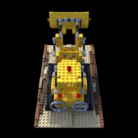

# NeRF
NeRF implementation using PyTorch

# Installation
```
git clone https://github.com/khsoo01/nerf.git
cd nerf
pip install -r requirements.txt
```

To download example data,
```
bash download_example_data.sh
```

# How to run
```
python3 [train.py | test.py] [config_path]
```

For example,
```
python3 train.py configs/config_chair.txt
```
```
python3 test.py configs/config_chair.txt
```

# Result Examples



